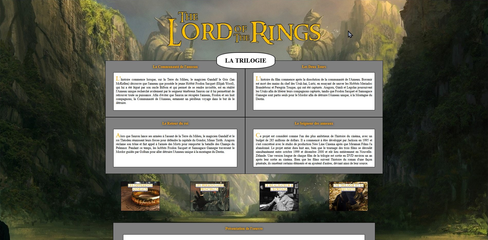
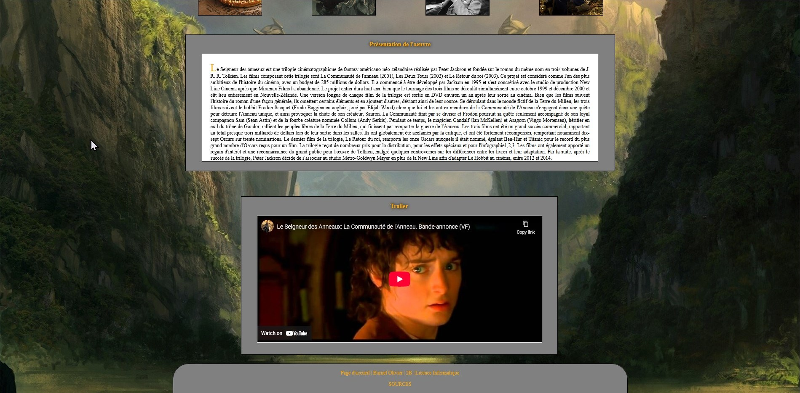
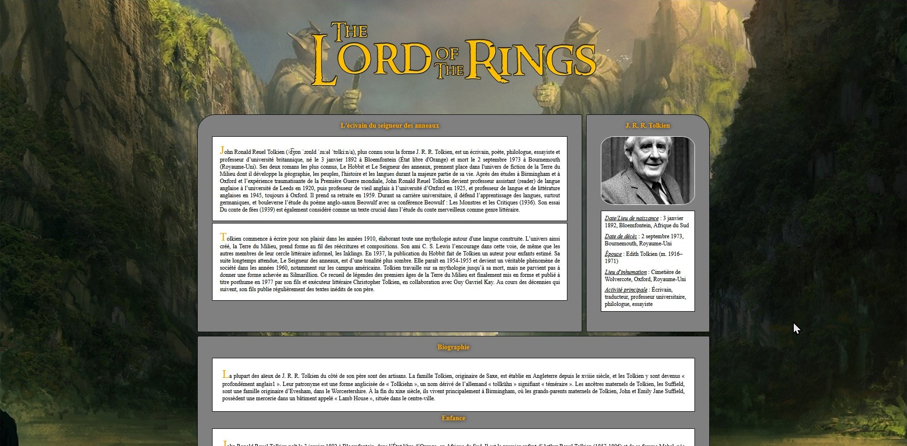
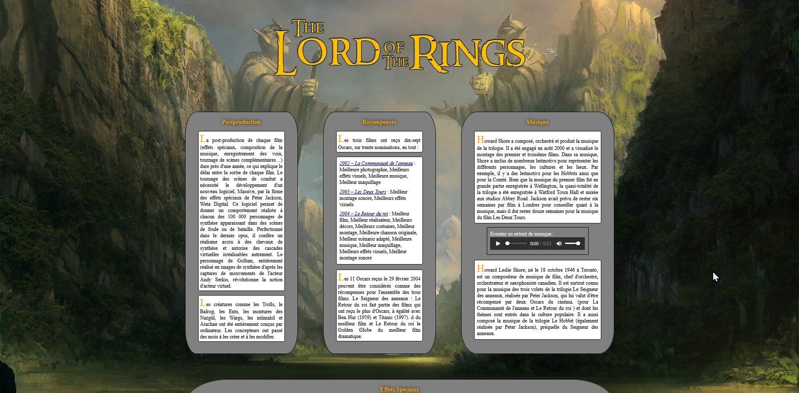

# First-Website
It's a website built using HTML and CSS. I experimented with the basics by implementing features such as an embedded trailer, playable music, styled first letters, hover effects, and use of various HTML tags. The site consists of multiple pages, each with its own specific CSS file in addition to a shared global stylesheet. My focus was not on the content or visual design, but rather on exploring and applying core web development functionalities.

# Images
<table>
	
  <tr>
  	<td></td>
    <td></td>
    <td></td>
  </tr>
</table>
